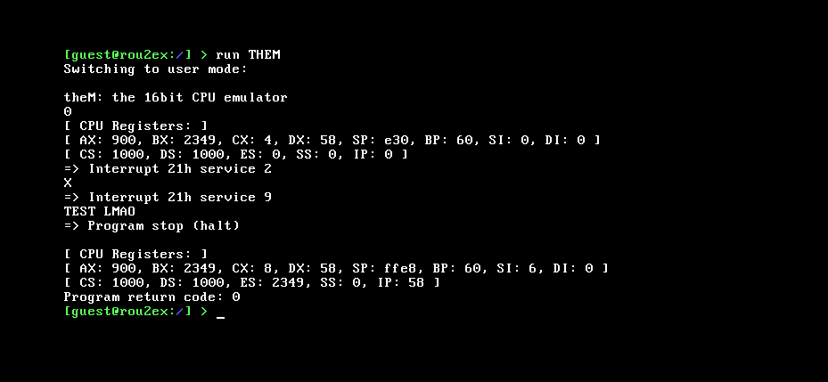

# theM

A 16-bit CPU emulator to be (MS-)DOS-friendly eventually.

## Preview



*^ Emulator's baby steps: Simple 16-bit x86 assembly program execution ---
emulated as a whole.*

## Usage

To build this app, `gcc`, `ld.lld`and `nasm` tools are required. Ensure having
these installed before building itself.

```shell
make build
```

This build procedure will produce the `THEM.ELF` executable. This file
can be added to the app collection on some floppy medium/image then.

### Example

Sample program `PRG0` demonstrates the functionality of some opcodes
and instructions implementations already done. It is very easy
to assemble using NASM:

```shell
nasm -f bin -o prg0.bin prg0.asm 
```

Then put those two files onto a floppy using the `mtools` for example.

```shell
dd if=/dev/zero of=fat.img bs=512 count=2880
mkfs.fat -F 12 fat.img
mcopy -i fat.img ${PATH_TO_ELF_FILE} ::THEM.ELF 
mcopy -i fat.img ${PATH_TO_BIN_FILE} ::PRG0.BIN 
```

Now it is time to start some [r2](htps://github.com/krustowski/rou2exOS) instance.
When booted, run it simply by typing:

```r2
run THEM
```
